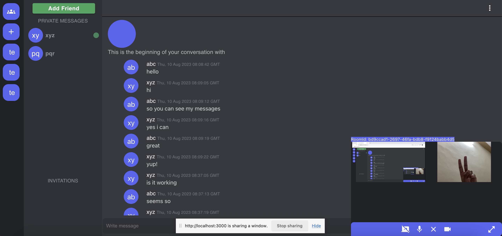

# Discord Clone:

A chatting and video calling app.

## Tech Stack:

1. React with TypeScript for UI.
2. Redux (Thunk for async dispatches) for state management.
3. Go backend (Gorilla websockets, chi router).
4. MySQL Database.
5. JWT Based authentication.
6. Material UI for styling.

## Image:

## Features:

1. Login/Register Functionality.
2. Friend Requests:
   1. Sending / Receiving them.
   2. Accepting / Rejecting them.
3. Websocket based functionality:
   1. Updating Friends List.
   2. Updating Friend Requests List.
   3. Updating the indicator whenever a friend comes online or goes offline.
   4. Chatting with friends.
4. Video calling using WebRTC.
   1. Multi user group video video call.
      1. Mesh architecture is used to setup peer connections hence it is not advised to have more than 4 ppl in a video group.
      2. Another way exists which requires some video processing on the sever side. (Not implemented)
   2. To call a friend first send him the video room id, after joining the room. A friend can enter the room.
   3. Audio and Video can be shut off. It is on by default.
   4. The code does not handle the scenario if a user does not have a camera and only wishes to join with audio. (Not implemented)
   5. Screen Sharing funtionality is there but sharing your camera stream along with screen share is not implemented. Sharing screen shuts off the camera video and vice versa.

## Possible Extension:

1. Add joining via audio only. (for users who do not have a camera)
2. Replace Mesh architecture for managing multiple users and use server methods - requires video processing on the server.
3. Option to send and recieve video call messages like on messengers or whatsapp.
4. Use a TURN server. The project does not use one hence it is possible that when it is deployed video chat might not work due to NATing.
